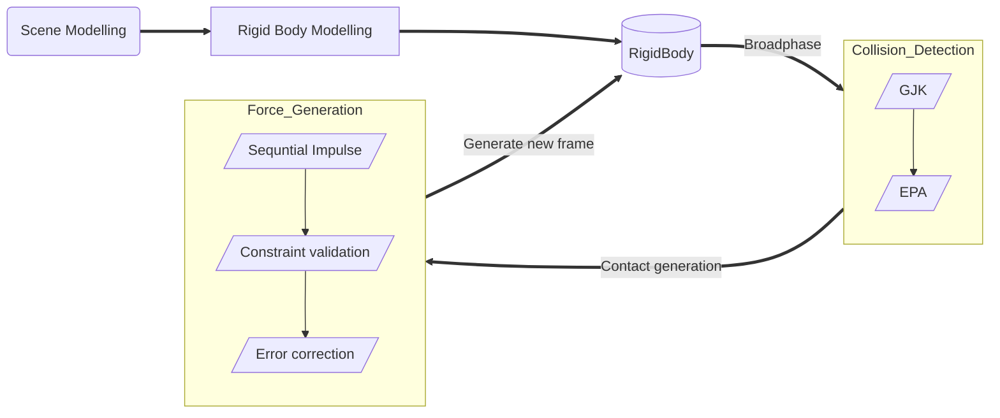

# Physics-Engine
Custom Game Physics Engine Implementation

```mermaid
flowchart LR
    subgraph Collision_Detection
        direction TB
        paraI[/"GJK"/] --> paraJ[/"EPA"/]
    end
    subgraph Force_Generation
        direction TB
        paraK[/"Sequntial Impulse"/] --> paraM[/"Constraint validation"/]-->paraL[/"Error correction"/]
    end
    H(Scene Modelling)==>A
    A[Rigid Body Modelling] ==>dbE[("RigidBody")]
    dbE==>|Broadphase|Collision_Detection
    Collision_Detection ==> |Contact generation|Force_Generation
    Force_Generation ==>|Generate new frame|dbE

```

## Rigid body
## Collisions
## Simulation
## Rules

