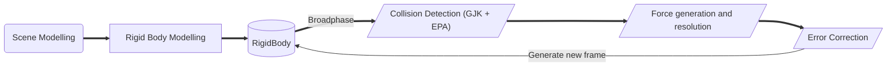

# Physics-Engine
Custom Physics Engine Implementation

```mermaid
flowchart LR
    H(Scene Modelling)==>A
    A[Rigid Body Modelling] ==>dbE[("RigidBody")]
    dbE==>|Broadphase| paraB[/"Collision Detection (GJK + EPA)"/]
    paraB ==> paraC[/"Force generation and resolution"/]
    paraC ==>paraD[/"Error Correction"/]
    paraD -->|Generate new frame|dbE

```

## Rigid body
## Collisions
## Simulation
## Rules

